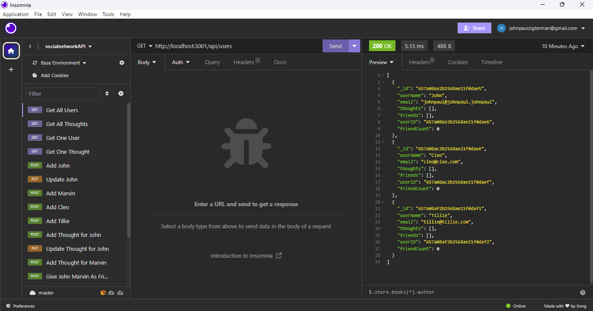

# Social Media API - John Zigterman

## Description

- For this project I set out to create a flexible and efficient API backend for a generic social media service.
- This backend allows the user to establish users, thoughts that the users can post, and reactions to those thoughts as objects that are all interrelated.
- For now, this project is just a backend. It requires the use of Insomnia or another API querying program.
- This project is set up to be easy to use on a locally hosted setup for development and testing.

## Installation

The user may install all of the necessary npm packages by typing 'npm i' in the console. This will set the program up for success.

## Usage

For the backend to be effective, the user must start the server using 'npm start' and then make requests to it using Insomnia or other means, following the requirements for JSON data when applicable, as in put and post requests.

## Credits

I, John Paul Zigterman, completed this project by myself with the aid of the resources provided to me by the MSU coding bootcamp.

## Link

https://github.com/JohnPaulZigterman/socialnetwork-API

## Screenshot

## Demonstration Video

[Demonstration Video Link](https://drive.google.com/file/d/1OIt8q61a81kz23oFcnF0yr4PsXv4AKAD/view?usp=sharing)

## License

MIT License

Copyright (c) 2023 John Paul Zigterman

Permission is hereby granted, free of charge, to any person obtaining a copy
of this software and associated documentation files (the "Software"), to deal
in the Software without restriction, including without limitation the rights
to use, copy, modify, merge, publish, distribute, sublicense, and/or sell
copies of the Software, and to permit persons to whom the Software is
furnished to do so, subject to the following conditions:

The above copyright notice and this permission notice shall be included in all
copies or substantial portions of the Software.

THE SOFTWARE IS PROVIDED "AS IS", WITHOUT WARRANTY OF ANY KIND, EXPRESS OR
IMPLIED, INCLUDING BUT NOT LIMITED TO THE WARRANTIES OF MERCHANTABILITY,
FITNESS FOR A PARTICULAR PURPOSE AND NONINFRINGEMENT. IN NO EVENT SHALL THE
AUTHORS OR COPYRIGHT HOLDERS BE LIABLE FOR ANY CLAIM, DAMAGES OR OTHER
LIABILITY, WHETHER IN AN ACTION OF CONTRACT, TORT OR OTHERWISE, ARISING FROM,
OUT OF OR IN CONNECTION WITH THE SOFTWARE OR THE USE OR OTHER DEALINGS IN THE
SOFTWARE.